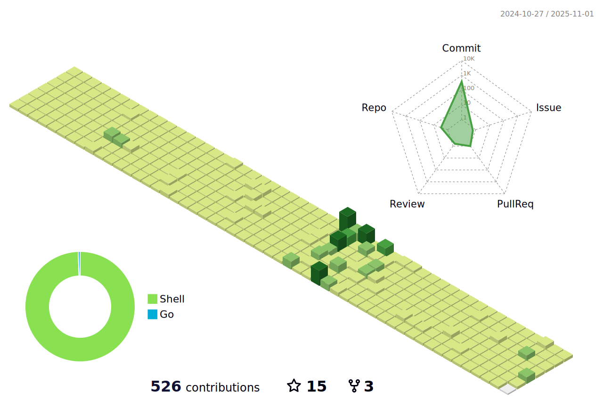

[//]: # (![]&#40;assets/Bottom_up.svg&#41;)

<!--   my-icons -->
<p align="center">
    <a href="https://github.com/lauvinson/lauvinson"></a>
    <a href="https://github.com/python/cpython"></a>
    <a href="https://github.com/lauvinson/lauvinson/graphs/contributors"></a>
    <a href="https://github.com/lauvinson/lauvinson/stargazers"></a>
    <a href="https://github.com/lauvinson/lauvinson/network/members"></a>
       
</p>

<!--   my-header-img -->


[//]: # (<a href="https://www.python.org/"></a>)


<!--   my-ticker -->    
[](https://git.io/typing-svg)


<!--   my-skils 

| Property                                        | Data                                                                                                                                                                                                                                                                                                                                                                                                                                                                                                                                                                                                                                                                                                                                                                                                                                                                                                                                                                                                                                                                                                                                                                                                                                                                                                                                                                                                                                                                                                                                                                                                                                                                                                                                                                                                            |
|-------------------------------------------------|-----------------------------------------------------------------------------------------------------------------------------------------------------------------------------------------------------------------------------------------------------------------------------------------------------------------------------------------------------------------------------------------------------------------------------------------------------------------------------------------------------------------------------------------------------------------------------------------------------------------------------------------------------------------------------------------------------------------------------------------------------------------------------------------------------------------------------------------------------------------------------------------------------------------------------------------------------------------------------------------------------------------------------------------------------------------------------------------------------------------------------------------------------------------------------------------------------------------------------------------------------------------------------------------------------------------------------------------------------------------------------------------------------------------------------------------------------------------------------------------------------------------------------------------------------------------------------------------------------------------------------------------------------------------------------------------------------------------------------------------------------------------------------------------------------------------|
| **Language / IDE**                              |                                                                                                                                                                                                                                                                                                                                                                                                                                                                                                                                                                                                                                                                                                                                                                                                                                                                                                                                                                                                                                                                                                                                                                                                                                                                                                                                                                                                                                                                                                     |
| **Domain Knownledge**                           | []()[](https://github.com/lauvinson/lauvinson) [](https://github.com/search?q=user%3Alauvinson&type=Repositories) [](https://github.com/search?q=user%3Alauvinson&type=Repositories) [](https://github.com/search?q=user%3Alauvinson&type=Repositories)                                                                                                                                                                                                                                                                                                                                                                                                                                                                                                                                                                                                                                                                                                                                                                                                                                                                                                                                                                             |
| **CI / CD**                                     | [](https://github.com/lauvinson/lauvinson) [](https://github.com/lauvinson/lauvinson) [](https://github.com/lauvinson/lauvinson)                                                                                                                                                                                                                                                                                                                                                                                                                                                                                                                                                                                                                                                                                                                                                                                                                                                                                                                                                                                                                                                                                                                                                                                                                                                                                                                                                         |
| **Databases**                                   |                                                                                                                                                                                                                                                                                                                                                                                                                                                                                                                                                                                                                                                                                                                                                                                                                                                                                                                                                 |
| **OS**                                          | <a target="_blank" rel="noopener noreferrer" href="https://camo.githubusercontent.com/b44114213a5a462903bd69611bb6846f1dc41fe6f3230bd37c67c3d4eb65f08c/68747470733a2f2f696d672e736869656c64732e696f2f62616467652f2d57696e646f77732d626c61636b3f7374796c653d666c61742d737175617265266c6f676f3d77696e646f7773266c6f676f436f6c6f723d626c7565"></a> <a target="_blank" rel="noopener noreferrer" href="https://camo.githubusercontent.com/9c4bc049e33f41f122342a1714ccf872c34098a9f2c593c33c2322cf0129fa04/68747470733a2f2f696d672e736869656c64732e696f2f62616467652f2d5562756e74752d626c61636b3f7374796c653d666c61742d737175617265266c6f676f3d7562756e7475"></a>                                                                                                                                                                                                                                                                           |
| **Tools & Platform**                            |                                                                                                                                                                                                                                                                                                                                                                                                                                                                                                                                                                                                                                                                                                                                                                                                                                                                                                                                                                                                                                                                                                                                                                                                                                                                                                                                                                                               |
| **Machine Learning / Deep Learning frameworks** | ![Jupyter Notebook](http://img.shields.io/badge/-Jupyter%20Notebook-eee?style=flat-square&logo=data:image/png;base64,iVBORw0KGgoAAAANSUhEUgAAAA4AAAAQCAMAAAARSr4IAAACGVBMVEVhYmJdYWT/fBfzdyaqdlV2dnfcdC9udnz5dyKUaU3wdicCO2CzZzVdUkpOTk5MTk60ZzUAAP/XcC3fcivgciv/lArAajLqdSifYjrydyajnJjEjWifnp3FjGcAAACenp52dnd2dnd2dndhYmJhYmIxW3bzdybzdybzdybzdybzdyb/dxpydnl2dnd2dndhYmJgYmOda0r0dyXzdybzdybzdybudymQdmZldoJQYGmRaU7ydyfzdybzdybzdybzdybzdybzdybzdyb1dyX9dx/2dyXzdybzdybzdyb+eiPzdybzdybzdyb/ghz8eSQ3SFT/tABNTk5HTFBMTk5OTk5OTk5OTk5OTk5OTk5OTk5OTk5OTk5NTk5GTFBOTk5OTk5OTk5OTk5OTk5OTk5OTk5OTk5OTk5OTk5OTk5OTk5OTk5OTk5OTk5NTk5OTk5OTk5OTk5OTk5OTk5OTk5OTk5OTk5NTk5NTk5UUEx5WUMAOGRMTU9OTk5OTk5OTk5OTk5OTk5FTFAXQFvBajK8aTP2eCX0dyb0dyb0dybzdyb4eCXzdybzdybzdybzdybzdybzdybzdybzdybzdyb6dB3zdyXzdybzdybzdybzdybzdybzdybzdyaenp6cn6HKimD0dyXzdybzdybzdybzdybzdybzdyaenp6enp6dn6Dzdybzdyaenp6enp6enp6enp7zdyaenp7///9F1GYlAAAAsHRSTlMAAAAAAAAAAAAAAAAAAAAAAAAAAAAAAAAAAAAAAAAAADHCVho4Ax1RcnFOFz/ibFmwHXPc/thwKwkKJpfbqn1oaX+uighRdSIDAyV6TAQcAgIVHBMbKjIgEzBTHCsbLUBdQlhiTWBlR1xkaEVIR1tPbFEvF0pJNR9AFAQIMwgfKQUDBwgDBEsuMkcCLLSUKBsqT5iwNcX47N/g7cAxPmUqZq/OzaxiExPJYgQPCJjcP9lVnrgAAAClSURBVAjXVcyxSoIBAEXh+xkhEkFr6hD0AM5BkbQ3ODaEY4uDSENCS1BThI/h4v4TERG0NzZHvoAQ0SDV8FvkmS6cw5UgSTR5s83rlgUvWuA8l/Bs59eYbXhS28VdUt1H4dA9Eu1HexUdS3T/7Y81vXJ9rQicLcxoAK64hvd1fWwOeDgoy+JW3bCs56tOonnxd3ycGKt9nt7I91GShgn60yRJI/kBP8EfEEdOa6sAAAAASUVORK5CYII=&logoColor=F37626)    |
-->

```rust
struct Profile;

impl Profile {
    const NAME: &'static str = "Vinson";
    const LOCATION: &'static str = "Shenzhen, China";
    const ROLE: &'static str = "FSD/BSD";
    const EXPERIENCE: &'static str = "6+ years";
}

struct Skills;

impl Skills {
    const LANGUAGES: [&'static str; 5] = ["Jvm", "Go", "Python", "ECMAScript", "C/C++"];
    const OPERATION_SYSTEMS: [&'static str; 3] = ["macOS", "Linux", "Windows"];
    const STORAGES: [&'static str; 5] = ["ClickHouse", "Elastic", "MongoDB", "Redis", "MySQL"];
    const MESSAGE_QUEUES: [&'static str; 3] = ["Kafka", "RocketMQ", "RabbitMQ", "NSQ"];
    const WEB_FRAMEWORKS: [&'static str; 4] = ["gRpc", "Spring", "Flask", "Express"];
    const DEVOPS: [&'static str; 3] = ["Docker", "Drone", "Kubernetes"];
    const BIG_DATA: [&'static str; 3] = ["Hadoop", "Spark", "Flink"];
    const MACHINE_LEARNING: [&'static str; 3] = ["TensorFlow", "Jupyter", "Colab", "HuggingFace"];
}

struct DomainKnowledge;

impl DomainKnowledge {
    const MUSIC_ENGINEERING: &'static str = "Music Engineering";
    const COMPUTER_SCIENCE: &'static str = "Computer Science";
    const SOFTWARE_DEVELOPMENT: &'static str = "Software Development";
    const MACHINE_LEARNING: &'static str = "Machine Learning";
    const DIGITAL_MEDIA: &'static str = "Digital Media";
}
```

<!--   stats graph -->
### 📈 Activity Graph:

<!--   profile-green-animate -->


<!--   grid-snake -->


<!--   skyline 
<a href="https://skyline.github.com/lauvinson/2022"></a>
-->

<!--  2d history skills -->

[//]: # (</img>)


   <!--machine-learning-->
```mermaid
graph TD;
    machine-learning-->Data;
    machine-learning-->Algorithms;
    machine-learning-->Statistical-Models;
    machine-learning-->Feature-Engineering;
    machine-learning-->Evaluation-Metrics;
    machine-learning-->Deployment;
   ```


<!-- Belarus - My Home-->
  
 ```geojson
{
 "type": "FeatureCollection",
 "features": [
   {
     "type": "Feature",
     "id": 1,
     "properties": {
       "ID": 0
     },
     "geometry": {
       "type": "Polygon",
       "coordinates": [
         [
             [23.5,53.9],
             [32.6,52.6]
         ]
       ]
     }
   }
 ]
}

```

[//]: # ([MIT]&#40;LICENSE&#41;)


